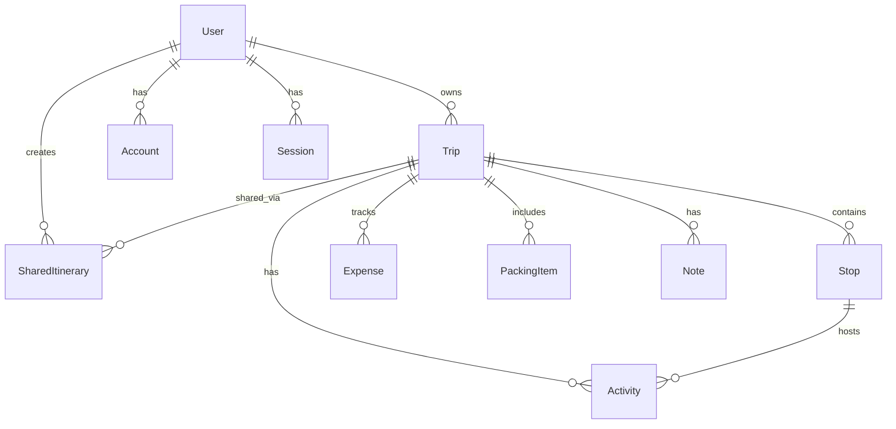

<p align="center">
  <h1 align="center">🌍 Traveloop</h1>
  <p align="center">
    <strong>Plan smarter journeys — itineraries, budgets, packing, and sharing in one place.</strong>
  </p>
  <p align="center">
    <a href="https://travelop-six.vercel.app"></a>
  </p>
  <p align="center">
    <a href="https://nextjs.org/"></a>
    <a href="https://react.dev/"></a>
    <a href="https://www.typescriptlang.org/"></a>
    <a href="https://tailwindcss.com/"></a>
    <a href="https://www.prisma.io/"></a>
    <a href="https://neon.tech/"></a>
    
  </p>
</p>

---

**Traveloop** is a production-grade travel planning SaaS built with the **Next.js 15 App Router**, **React 19**, **TypeScript**, **Tailwind CSS**, **Prisma**, **Neon PostgreSQL**, **NextAuth**, **TanStack Query**, **Framer Motion**, and **Recharts**.

It helps travelers organize trips by building daily itineraries, managing budgets, tracking packing lists, keeping travel journals, and sharing plans with friends or family — available on **Web**, **Android**, and **iOS**.

> 🌐 **Live at:** [https://travelop-six.vercel.app](https://travelop-six.vercel.app)

---

## ✨ Features

| | Feature | Description |
|---|---|---|
| 🔐 | **Authentication** | Credentials auth with bcrypt hashing, Prisma Adapter, JWT sessions (30-day), protected routes via middleware, signup, login, forgot-password, and logout |
| 🗺️ | **Trip Dashboard** | Full CRUD for trips with multi-city stops, activities, expenses, packing items, notes, and shared itineraries — all backed by PostgreSQL |
| 📅 | **Visual Calendar** | Monthly, weekly, daily, and list views powered by FullCalendar with drag-and-drop rescheduling |
| 🏗️ | **Itinerary Builder** | Interactive stop/activity management with drag-and-drop ordering (dnd-kit), cost sidebar, timeline cards, and real-time persisted updates |
| 🔍 | **Live Discovery** | Destination search, weather forecasts, interactive maps, and activity/event discovery via Mapbox, OpenWeather, Google Places, Yelp, and Ticketmaster |
| 💰 | **Budget & Expenses** | Expense tracking with categories (Flight, Food, Lodging, Transport, etc.), remaining budget calculations, alerts, and Recharts visualizations |
| 🎒 | **Smart Packing** | Category-based packing checklists with progress tracking, packed/unpacked toggles, quantities, and custom categories |
| 📓 | **Notes & Journal** | Pinnable trip notes with journal dates, image attachments via Cloudinary, rich text body, and autosave |
| 🤝 | **Social Sharing** | Public/private trip visibility, shareable links with VIEW/COPY permissions, expirable share URLs, community feed, and traveler previews |
| ⚙️ | **User Settings** | Account and preference management dashboard |

---

## 🛠️ Tech Stack

### Web (Next.js)

| Layer | Technologies |
|---|---|
| **Frontend** | Next.js 15 App Router, React 19, TypeScript, Tailwind CSS, shadcn/ui (Radix Primitives), Framer Motion, Inter font (Google Fonts) |
| **Backend** | Next.js Route Handlers, Server Actions, NextAuth v4, Prisma ORM |
| **Database** | Neon PostgreSQL — pooled URL (runtime) + direct URL (migrations) |
| **State & Data** | TanStack Query, React Hook Form, Zod validation, Zustand |
| **Charts** | Recharts |
| **Integrations** | Mapbox GL, OpenWeather, Google Places, Yelp, Ticketmaster, Cloudinary, Resend |
| **SEO** | OpenGraph, Twitter Cards, JSON-LD structured data, canonical URLs, robots meta |

### Android (Kotlin)

| | |
|---|---|
| **Language** | Kotlin |
| **Build System** | Gradle (Kotlin DSL) |
| **Location** | [`Traveloop-Android/`](Traveloop-Android/) |

### iOS (Swift)

| | |
|---|---|
| **Language** | Swift |
| **Platform** | Swift Playgrounds / Xcode |
| **Architecture** | MVVM — SwiftUI views, dedicated networking and session layers |
| **Location** | [`Traveloop.swiftpm/`](Traveloop.swiftpm/) |

---

## 📁 Project Structure

```
Traveloop/
├── src/
│   ├── app/                       # Next.js App Router
│   │   ├── (auth)/                #   Auth pages
│   │   │   ├── login/             #     Login
│   │   │   ├── signup/            #     Signup
│   │   │   └── forgot-password/   #     Password recovery
│   │   ├── (dashboard)/           #   Protected dashboard
│   │   │   ├── dashboard/         #     Main dashboard
│   │   │   ├── trips/             #     Trip list & management
│   │   │   ├── itinerary/         #     Itinerary builder
│   │   │   ├── calendar/          #     Calendar views
│   │   │   ├── activities/        #     Activity management
│   │   │   ├── budget/            #     Budget & expenses
│   │   │   ├── packing/           #     Packing checklists
│   │   │   ├── notes/             #     Notes & journal
│   │   │   ├── shared/            #     Shared itineraries
│   │   │   └── settings/          #     User settings
│   │   ├── api/                   #   API route handlers
│   │   │   ├── auth/              #     NextAuth endpoints
│   │   │   ├── trips/             #     Trip CRUD
│   │   │   ├── community/         #     Community feed
│   │   │   ├── discover/          #     Place discovery
│   │   │   ├── live/              #     Live data feeds
│   │   │   ├── search/            #     Search
│   │   │   ├── weather/           #     Weather forecasts
│   │   │   ├── uploads/           #     Image uploads (Cloudinary)
│   │   │   ├── shared/            #     Public shared trips
│   │   │   ├── share-invite/      #     Share invitation links
│   │   │   ├── dashboard/         #     Dashboard data
│   │   │   └── health/            #     Health checks (db, env)
│   │   ├── download/              #   App download page
│   │   └── trips/                 #   Public trip pages
│   ├── actions/                   # Server actions
│   │   ├── trips.ts               #   Trip operations
│   │   ├── sharing.ts             #   Share management
│   │   └── live-discovery.ts      #   Discovery actions
│   ├── components/                # UI components
│   │   ├── ui/                    #   shadcn/ui primitives
│   │   ├── auth/                  #   Auth forms
│   │   ├── layout/                #   Layouts & navigation
│   │   ├── marketing/             #   Landing page
│   │   ├── product/               #   Product components
│   │   └── traveloop/             #   Trip-specific components
│   ├── features/                  # Feature modules
│   │   ├── budget/                #   Budget tracking & analytics
│   │   ├── calendar/              #   FullCalendar integration
│   │   ├── itinerary/             #   Itinerary builder & timeline
│   │   ├── live/                  #   Live discovery (maps, weather, places)
│   │   ├── productivity/          #   Packing lists, notes, journal
│   │   ├── sharing/               #   Social sharing & community
│   │   └── traveloop/             #   Core trip management
│   ├── hooks/                     # Custom React hooks
│   ├── lib/                       # Utilities, Prisma client, auth config
│   ├── store/                     # Zustand stores
│   ├── types/                     # TypeScript type definitions
│   └── middleware.ts              # NextAuth route protection
├── prisma/                        # Schema, migrations, seed script
├── public/                        # Static assets & downloads
├── docs/                          # Project documentation (Obsidian vault)
├── Traveloop-Android/             # Android app (Kotlin / Gradle)
├── Traveloop.swiftpm/             # iOS app (Swift Playgrounds)
├── vercel.json                    # Vercel deployment config (iad1 region)
└── package.json                   # pnpm 11 workspace
```

---

## 🗃️ Database Schema

The database is PostgreSQL (hosted on Neon), managed via Prisma. See [`prisma/schema.prisma`](prisma/schema.prisma) for exact definitions.



| Model | Purpose | Key Fields |
|---|---|---|
| **User** | Primary account | `email`, `passwordHash`, `image` |
| **Trip** | Root travel entity | `destination`, `startsAt`/`endsAt`, `budget`, `currency`, `status`, `visibility` |
| **Stop** | Locations within a trip | `kind` (City/Region/Lodging/Transit), `latitude`/`longitude`, `placeId`, `position` |
| **Activity** | Events & plans | `category` (Food/Tour/Culture/etc.), `cost`, `bookingUrl`, linked to Trip or Stop |
| **Expense** | Financial tracking | `amount`, `category` (Flight/Food/Lodging/etc.), `paidBy`, `incurredAt` |
| **PackingItem** | Packing checklist | `category` (Clothing/Electronics/Documents/etc.), `quantity`, `packed` |
| **Note** | Trip notes & journal | `body`, `journalDate`, `imageUrl`, `pinned` |
| **SharedItinerary** | Public sharing | `slug`, `permission` (VIEW/COPY), `expiresAt` |

---

## 🚀 Getting Started

### Prerequisites

- **Node.js** 24 LTS (recommended)
- **pnpm** 11+
- **PostgreSQL** — [Neon](https://neon.tech/) (recommended) or any PostgreSQL 15+ instance

### 1. Clone & Install

```bash
git clone https://github.com/Aadishah17/Traveloop.git
cd Traveloop
pnpm install
```

### 2. Environment Variables

Copy `.env.example` to `.env` and fill in your credentials:

```bash
cp .env.example .env
```

| Variable | Required | Description |
|---|:---:|---|
| `DATABASE_URL` | ✅ | Neon pooled connection string (runtime) |
| `DIRECT_URL` | ✅ | Neon direct connection string (Prisma migrations) |
| `NEXTAUTH_SECRET` | ✅ | Random secret for JWT signing (`openssl rand -base64 32`) |
| `NEXTAUTH_URL` | ✅ | App base URL — `http://localhost:3000` for local dev |
| `MAPBOX_TOKEN` | — | Server-side Mapbox access |
| `NEXT_PUBLIC_MAPBOX_TOKEN` | — | Client-side Mapbox GL maps |
| `OPENWEATHER_API_KEY` | — | Weather forecasts |
| `GOOGLE_PLACES_API_KEY` | — | Place search & details |
| `YELP_API_KEY` | — | Restaurant & activity search |
| `TICKETMASTER_API_KEY` | — | Live event discovery |
| `CLOUDINARY_URL` | — | Image upload & hosting |
| `RESEND_API_KEY` | — | Transactional emails |

> **Note:** Use the Neon **pooled** URL for `DATABASE_URL` (runtime) and the **direct** URL for `DIRECT_URL` (migrations). Optional API keys can be left empty — the app degrades gracefully.

### 3. Database Setup & Seeding

```bash
pnpm prisma:generate        # Generate Prisma client
pnpm prisma:migrate          # Run database migrations
pnpm db:seed                 # Seed demo data
```

The seed creates a demo user with a sample **"Tokyo Spring Loop"** trip including stops, activities, expenses, packing items, notes, and a shared itinerary.

**Demo Credentials:**

| Email | Password |
|---|---|
| `demo@traveloop.app` | `Traveloop123!` |

### 4. Run the Development Server

```bash
pnpm dev
```

Open [http://localhost:3000](http://localhost:3000) to view the app.

---

## 📋 Available Scripts

| Script | Command | Description |
|---|---|---|
| Dev server | `pnpm dev` | Start Next.js dev server |
| Build | `pnpm build` | Generate Prisma client + production build |
| Start | `pnpm start` | Start production server |
| Type check | `pnpm typecheck` | Run `tsc --noEmit` |
| Lint | `pnpm lint` | Run ESLint |
| Prisma generate | `pnpm prisma:generate` | Regenerate Prisma client |
| Prisma migrate | `pnpm prisma:migrate` | Run pending migrations |
| Prisma Studio | `pnpm prisma:studio` | Open Prisma Studio GUI |
| Seed database | `pnpm db:seed` | Seed demo user & trip data |

---

## ✅ Health Checks

| Endpoint | Purpose |
|---|---|
| `GET /api/health/db` | Verifies PostgreSQL connectivity |
| `GET /api/health/env` | Reports whether integration API keys are configured |

---

## 📱 Mobile Apps

### Android

The Android companion app lives in [`Traveloop-Android/`](Traveloop-Android/) and is built with **Kotlin** and **Gradle (Kotlin DSL)**.

```bash
cd Traveloop-Android
./gradlew build
```

### iOS

The iOS companion app lives in [`Traveloop.swiftpm/`](Traveloop.swiftpm/) and uses **SwiftUI** with an MVVM architecture — including dedicated networking, session management, and theming layers.

Open `Traveloop.swiftpm/` in **Xcode** or **Swift Playgrounds** to build and run.

---

## 🚢 Deployment

Traveloop is configured for **Vercel + Neon** (US East — `iad1` region):

1. Create a [Neon](https://neon.tech/) database and copy pooled + direct URLs
2. Add all variables from `.env.example` to **Vercel → Project Settings → Environment Variables**
3. Run Prisma migrations against Neon before the first production deploy:
   ```bash
   DATABASE_URL="your-direct-neon-url" npx prisma migrate deploy
   ```
4. Deploy via Vercel — the included [`vercel.json`](vercel.json) handles framework detection, install, and build commands
5. Configure production API keys for Mapbox, OpenWeather, Google Places, Yelp, Ticketmaster, Cloudinary, and Resend

---

## 🤝 Contributing

Contributions are welcome! To get started:

1. **Fork** the repository
2. **Create** a feature branch — `git checkout -b feature/amazing-feature`
3. **Commit** your changes — `git commit -m 'Add amazing feature'`
4. **Push** to the branch — `git push origin feature/amazing-feature`
5. **Open** a Pull Request

---

## 📄 License

This project is licensed under the **MIT License**.